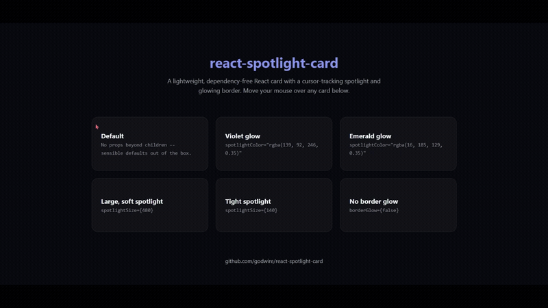

# react-spotlight-card

[](https://www.npmjs.com/package/react-spotlight-card)
[](https://github.com/godwire/react-spotlight-card/actions/workflows/ci.yml)
[](https://bundlephobia.com/package/react-spotlight-card)
[](LICENSE)

A lightweight React card component with a cursor-tracking spotlight glow and
an optional glowing border — **zero dependencies beyond React itself**. No
Tailwind, no Framer Motion, no animation library required.

## Demo

**🔗 Live link:** _coming soon — see "Deploying the demo" below_



## Why

Most "spotlight card" effects come bundled with a whole design system —
Tailwind config, Framer Motion, sometimes both. This one is a single
component: one `pointermove` listener that writes the cursor position
straight to CSS custom properties on the DOM node via a `ref`, and a radial
gradient that reads them. No React state updates while the mouse moves, so
it stays smooth even in a grid of many cards.

- 📦 **Zero runtime dependencies** — only `react`/`react-dom` as peers
- ⚡ **No re-renders on mousemove** — position updates bypass React state entirely
- 🎨 **Fully themeable** — color, size, border glow, and transition speed are all props
- 🧩 **Framework-agnostic styling** — plain CSS, works with or without Tailwind
- 📐 **TypeScript** — full type definitions included
- 🪶 **Small** — see the bundle size badge above

## Install

```bash
npm install react-spotlight-card
```

## Usage

```tsx
import { SpotlightCard } from 'react-spotlight-card'
import 'react-spotlight-card/style.css'

function Example() {
  return (
    <SpotlightCard spotlightColor="rgba(139, 92, 246, 0.35)">
      <h3>Hover me</h3>
      <p>The glow follows your cursor.</p>
    </SpotlightCard>
  )
}
```

## Props

| Prop | Type | Default | Description |
|---|---|---|---|
| `children` | `ReactNode` | — | Card content |
| `className` | `string` | `''` | Extra class name(s) on the outer element |
| `style` | `CSSProperties` | — | Inline styles, merged with the component's own CSS variables |
| `spotlightColor` | `string` | `'rgba(255, 255, 255, 0.20)'` | Any valid CSS color, including `rgba()` for opacity |
| `spotlightSize` | `number` | `300` | Diameter of the glow, in pixels |
| `borderGlow` | `boolean` | `true` | Also render a glowing gradient border that follows the cursor |
| `transitionDuration` | `number` | `300` | Fade in/out duration in milliseconds |

The component renders a plain `<div>` with your `children` inside — it
doesn't impose any layout, padding, or background of its own, so it drops
into any design system.

## Development

```bash
git clone https://github.com/godwire/react-spotlight-card.git
cd react-spotlight-card

npm install          # installs the library's dev dependencies
npm run dev          # launches the example app at http://localhost:5173,
                      # importing the component straight from src/ (no build step)
```

Other useful scripts:

```bash
npm run typecheck    # tsc --noEmit
npm run build         # builds dist/ (ESM + CJS + .d.ts + style.css)
```

The `example/` app is a separate Vite project that aliases
`react-spotlight-card` to `../src/index.ts`, so the demo always reflects
whatever is currently in `src/` — no linking or rebuilding needed while
you iterate on the component.

## Deploying the demo

```bash
cd example
npm run build
```

Deploy the resulting `example/dist` folder anywhere static (Vercel,
Netlify, GitHub Pages). On Vercel: import this repo, set **Root Directory**
to `example`, framework preset **Vite** — that's it, no environment
variables needed since the demo has no backend.

## Publishing to npm

```bash
npm run build
npm login
npm publish
```

`files: ["dist"]` in `package.json` means only the built output is
published, not the source or the example app.

## License

MIT — see [LICENSE](LICENSE).